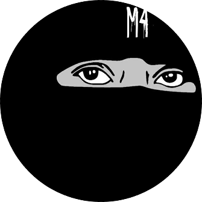

# 👊 M4nifest0 Black Hat Hacking Team™💪

## Features

- Shadowsocks is a free and open-source encryption protocol project, widely used in China to circumvent Internet censorship.
- It was created in 2012 by a Chinese programmer named "clowwindy", and multiple implementations of the protocol have been made available since. Wikipedia
- windows: 4.4.0.0 / 31 December 2020; 13 months ago
- libev: 3.3.5 / 15 September 2020; 17 months ago
- rust: 1.12.5 / 17 December 2021; 1 month ago
- Developer: Free and open-source software
- go: 0.1.5 / 2 May 2021; 9 months ago
- python: 2.9.1 / 2 January 2017; 5 years ago
- Programming languages: Go, C, Rust, Kotlin, Swift, C#, Objective-C
- VMess, Shadowsocks, Trojan, Snell protocol support for remote connections
- Built-in DNS server that aims to minimize DNS pollution attack impact, supports DoH/DoT upstream and fake IP.
- Rules based off domains, GEOIP, IPCIDR or Process to forward packets to different nodes
- Remote groups allow users to implement powerful rules. Supports automatic fallback, load balancing or auto select node based off latency
- Remote providers, allowing users to get node lists remotely instead of hardcoding in config
- Netfilter TCP redirecting. Deploy Clash on your Internet gateway with `iptables`.
- Comprehensive HTTP RESTful API controller

## # Main repository for downloading tools[windows 11,10,8,7]

- TUN mode on and Windows. [Doc](https://raw.githubusercontent.com/Jigsaw-Code/outline-releases/master/client/stable/Outline-Client.exe)

## # Main repository for downloading tools[MacOS]

- TUN mode on and MacOS. [Doc](https://itunes.apple.com/us/app/outline-app/id1356178125)

## # Main repository for downloading tools[Linux]

- TUN mode on macOS, Linux. [Doc](https://raw.githubusercontent.com/Jigsaw-Code/outline-releases/master/client/stable/Outline-Client.AppImage)

*Using the Terminal*

Make the AppImage executable: `chmod +x my.AppImage`

Run the AppImage: `./my.AppImage`

That’s it! The AppImage should now be executed.

## # Main repository for downloading tools[Android]

- TUN mode on Android. [Doc](https://play.google.com/store/apps/details?id=org.outline.android.client)

## # Main repository for downloading tools[IOS]

- TUN mode on IOS. [Doc](https://itunes.apple.com/us/app/outline-app/id1356177741)

## # See how it works

- 🤡 Usage_Training. [Click](https://t.me/M4nifest0/707) 

## # Visit the following channels and sites for more training and tools:

- 🔞 Darknet. [Click](https://m4nifest0.com)
- 🔞 DarkWeb. [Click](http://afe36vr4gqncdsekksl5ka3xahemj4cpnguj5t7wwp5vxvhff3h5g2qd.onion)
- 🔞 Telegram_Channel. [Click](https://t.me/M4nifest0)

<h2>

	
</a>&nbsp;&nbsp;&nbsp;&nbsp;
	&nbsp;&nbsp;&nbsp;&nbsp;
	&nbsp;&nbsp;&nbsp;&nbsp;
	&nbsp;&nbsp;&nbsp;&nbsp;
	&nbsp;&nbsp;&nbsp;&nbsp;

# Description
*************
-📌 Confidential/sensitive intel(Updated as of 5/1/2021)
On this section of the site you can find intel(most of which has been paid for by me) which has been leaked to the public for free. In addition to that new leaks will be added at the top of the page.

-📌 Rheinmetall Defence leaks(Updated link V3)
Download link: https://anonfiles.com/B0wfGbK2o9/files_zip
Details: This set of files was obtained from the European defence contractor known as Rheinmetall defence. There are a total of 1400 files all of which were obtained very recently. These include, military contracts, emails, business dealings of the company, details and drawings of some of their products along with a multitude of other kinds of information are present in this set of files.

-📌 Weapon Data Link User Manual
Download link: http://k6nfsszobpyoniyk.onion/?RhZS8xOOhEkQxOvb9sKGtfG9yBJ
Details: Leaked by an insider from the Tactical Communications Group. It consists of 51 pages in total and has pretty interesting info on a certain weapon data system.

-📌 2019 leaks:
US Intelligence contractors DB
Download link: https://anonfile.com/ZbD1M3Xcm1/USIntelligenceKelvinSecTeam_zip
Details: According to the hackers who obtained this db, it was taken from a cloud server owned by the US government.

Minor Government Databases
Bangladesh government database leak
Download link:https://114.130.54.243/trainee_infos.sql
Details: Hacked from http://seip-fd.gov.bd/

-📌 Chile Government DB
Download link: https://anonfile.com/R4U2J7X8m1/chile_gov_sql

-📌 Peru Government Db
SQL: http://198.96.91.44/04_data_ouath2.sql
Details: Hacked from http://evaluaciondocente.perueduca.pe/

-📌 Canada Government Speakers DB
Backup: https://96.125.169.17/speakerscanada.com.zip
Details: From http://speakerscanada.com/

-📌 utepda.gob.do DB
Backup: https://anonfile.com/Oax462v9nf/DB_zip
Details: Hacked from utepda.gob.do

-📌 fda.hhs.gov DB
Backup: https://anonfile.com/Ycr9xdvcnd/fda.hhs.gov_zip
Details: Hacked from fda.hhs.gov

https://www.dded.gov.in/ DB
Login: http://43.255.141.55/0422MR/oims/?login&next=Dashboard
SQL: http://43.255.141.55/aioims%20(5).sql
Details: Hacked from https://www.dded.gov.in/

-📌 Venezuela Papers
Venezuelan Confidential documents(2017-18)
Download link: http://www.mediafire.com/file/x2199gt1jnxcyec/Venzueleun_gov_documents.zip/file
Details: 100+ Files "borrowed" from a important Venezuelan government site(from its intranet).

-📌 Venezuelan latest classified documents
Download links: ksecureteam.com/order/v3/FuerteTiunaArmyBase.zip
ksecureteam.com/order/v3/FuerzaAerea.zip
ksecureteam.com/order/v3/govermentvenezuelan.zip
Details: Includes army db and loads of classified info.
Venezuelan Election database
Download link: ksecureteam.com/order/VenezuelElectionDatabase.zip
Details: Hacked election db(over 1 gb).

-📌 Infocentro Goverment Venezuelan DataBase
Download link:https://www.sendspace.com/file/0mhp34

-📌 BACKUPs Banks Of Venezuela
http://181.225.58.110/

-📌 Intimate details of some Chinese Communist party members(updated link V2)
Download link: https://anonfiles.com/PbZfq0O9u2/201812chinese_zip
Details: Includes intimate details of some Chinese communist party members in two specific regions

-📌 Colombian government leaks
Colombian government databases with admin access for some of the hacked sites:
Download link: http://www.mediafire.com/file/6umd2bkts8p4re2/Colombia_Priv8_Goverment_Explotation.zip/file

-📌 Colombia Police DNIs:
Docs: http://181.58.255.52/Scaner/

-📌 https://www.funcionpublica.gov.co
SQL: http://201.217.213.96/DB/evadb.sql

-📌 Transito Control System Colombia "Antioquia":
http://201.184.144.186:8080/
http://201.184.144.186:8080/TILEDCOVIPACIFICO/fotos/
Details: A few very interesting Colombian government leaks

-📌 M1 Abrams tank manuals
http://www.mediafire.com/file/m61wllvv6b2tlgl/tank.zip/file
Details: https://www.recordedfuture.com/reaper-drone-documents-leaked

-📌 MQ-9 reaper drone documents
Download link: https://www.sendspace.com/file/m182nc
Details: https://www.recordedfuture.com/reaper-drone-documents-leaked

----------------------
# 👊 M4nifest0 Black Hat Hacking Team™💪
----------------------
- 📌 Visit our channel or our site to download .

- 🔞 https://m4nifest0.com
- 🔞 https://m4nifest0.group
- 🔞 https://m4nifest0.shop
- 🔞 https://t.me/M4nifest0

----------------------

	
</a>&nbsp;&nbsp;&nbsp;&nbsp;
	&nbsp;&nbsp;&nbsp;&nbsp;
	&nbsp;&nbsp;&nbsp;&nbsp;
	&nbsp;&nbsp;&nbsp;&nbsp;
	&nbsp;&nbsp;&nbsp;&nbsp;
	&nbsp;&nbsp;&nbsp;&nbsp;

<h2>📌 Our team specializes in the following programming languages:...</h2> 

	
	
        
	
	
	
	
	
	

